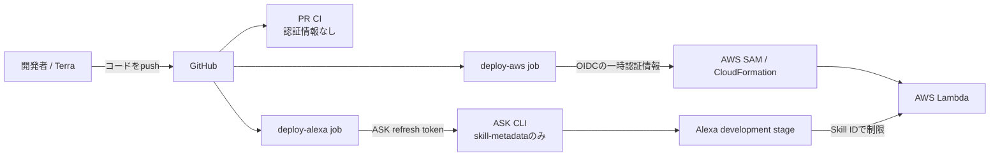

# Terra実装引き継ぎ

最終確認日: 2026-07-12

この文書は、Alexaスキル「じゃんけん風タイミングゲーム」のMVP実装契約です。
`README.md` は企画概要、この文書は実装時の判断基準として扱ってください。

## 1. 結論

元の開発方針は概ね妥当です。ただし、実装前に次の点を修正します。

1. IaCはAWS SAMに固定し、CDKとの選択を実装担当へ残さない。
2. GitHub ActionsからAWSへの認証には、長期アクセスキーではなくGitHub OIDCと一時認証情報を使う。
3. SAMをLambda・IAM・CloudWatch Logsの唯一の管理者にする。
4. ASK CLIは `ask deploy --target skill-metadata` だけを使い、Alexaのマニフェストと対話モデルだけを更新する。
5. Skill IDだけではASK CLIを認証できないため、Amazon Developer用のrefresh tokenも準備する。
6. `main` へのマージ先は、公開前のdevelopment環境とする。Alexa Storeのlive環境への公開は自動化しない。
7. Alexaは応答を話し終えた後にマイクを開くため、厳密な同時タイミングゲームではなく、Alexaの手を先に隠して確定するターン制ゲームとして実装する。

採用する技術構成は次のとおりです。

| 項目 | 採用方針 |
|---|---|
| 仮の表示名・起動名 | `チャージじゃんけん` |
| スキル種別 | Custom / Provision your own backend resources |
| 対応ロケール | `ja-JP` のみ |
| Alexa endpoint region | Default Region |
| AWSリージョン | `us-west-2` |
| バックエンド | AWS Lambda + TypeScript + ASK SDK v2 |
| Lambda runtime | `nodejs24.x` |
| IaC | AWS SAM |
| 状態管理 | Alexaのsession attributesのみ |
| AWS認証 | GitHub OIDCでIAMロールを引き受ける |
| Alexa認証 | ASK CLIのrefresh token |
| MVPデプロイ先 | Alexa development stage + 開発Lambda |

MVPでは必須のDefault RegionだけにLambda ARNを設定します。地域別エンドポイントは、複数リージョンへLambdaを展開する段階で追加します。

## 2. システムと責任境界



管理対象を次のように分離します。

| 管理対象 | 唯一の管理者 |
|---|---|
| Lambda、実行ロール、ログ、AlexaからのInvoke権限 | `template.yaml` とSAM |
| スキルマニフェスト、対話モデル | `skill-package/` とASK CLI |
| AWSへのデプロイ権限 | GitHub OIDC Pipeline Role |
| Alexa Developerへのデプロイ権限 | `ASK_REFRESH_TOKEN` |

通常の `ask deploy` は構成次第でLambdaやCloudFormationも更新するため使用禁止です。必ず `--target skill-metadata` を付けます。

## 3. MVPのゲーム仕様

### 3.1 行動とパワー

両者の初期パワーは0です。

| 行動 | パワー条件 | パワー更新 |
|---|---:|---:|
| 溜め | なし | +1 |
| 攻撃 | 1以上 | -1 |
| 防御 | なし | 変化なし |

- 攻撃のパワーは、相手の行動や勝敗に関係なく消費する。
- パワー0でユーザーが攻撃した場合、そのラウンドは進めず、同じAlexaの手を隠したまま再入力を求める。
- パワー上限と最大ラウンド数は設けない。
- 防御の連続使用制限も設けない。

### 3.2 勝敗

両者の行動とパワー更新は同時に起きたものとして扱います。

| ユーザー | Alexa | 結果 |
|---|---|---|
| 攻撃 | 溜め | ユーザーの勝ち |
| 溜め | 攻撃 | Alexaの勝ち |
| その他の組み合わせ | | 継続 |

### 3.3 Alexaの行動と公平性

- 第1ラウンドのAlexaの行動は必ず「溜め」とする。
- 第2ラウンド以降は、その時点で選択可能な行動から一様ランダムに選ぶ。
- 乱数生成関数は差し替え可能にし、ユニットテストを決定的にする。
- Alexaの行動はユーザーへ「せーの」と促す前に選び、`pendingAlexaAction` としてsession attributesへ保存する。
- ユーザーの現在の行動を受け取った後でAlexaの行動を選び直してはいけない。
- ユーザーの無効発話やパワー不足では `pendingAlexaAction` を維持する。

READMEにあった弱・中・強の難易度は、戦略と選択会話が未定義だったためMVP対象外とします。まず公平なランダム戦略で一連の音声体験を完成させ、難易度は次段階で追加します。「AI」という外部サービスや生成AI APIは使用しません。

### 3.4 ラウンドの処理順

1. ラウンド開始前の状態だけを使って、Alexaの行動を選び保存する。
2. Alexaが「せーの。溜め、攻撃、防御のどれかを言ってね」と発話し、セッションを開いたままにする。
3. ユーザーの発話を正規化し、現在のパワーで実行可能か検証する。
4. 両者のパワーを同時に更新する。
5. 勝敗を判定する。
6. 継続なら次ラウンド用のAlexaの行動を先に保存してから、次の入力を促す。
7. 決着なら勝数を更新し、再戦するか確認する。

### 3.5 再戦と状態保持

- 再戦時は両者のパワー、ラウンド数、保留中のAlexaの行動をリセットする。
- ゲーム開始時の `round` は1とし、有効な行動で継続したときだけ1増やす。
- 同一Alexaセッション中のユーザー勝数・Alexa勝数は保持する。
- セッションが終了したら全状態を破棄する。
- DynamoDBなどへの永続化はMVP対象外とする。

## 4. 会話設計

### 4.1 フェーズ

session attributesに次の状態を持たせます。

```ts
type Phase = 'AWAITING_READY' | 'AWAITING_ACTION' | 'AWAITING_REPLAY';

type GameSession = {
  phase: Phase;
  playerPower: number;
  alexaPower: number;
  playerWins: number;
  alexaWins: number;
  round: number;
  pendingAlexaAction?: 'charge' | 'attack' | 'defend';
};
```

状態遷移は次のとおりです。

| 現在のフェーズ | 入力 | 処理と次のフェーズ |
|---|---|---|
| なし | `LaunchRequest` | 準備確認を行い `AWAITING_READY` |
| `AWAITING_READY` | Yes / Start | ゲームを初期化し `AWAITING_ACTION` |
| `AWAITING_READY` | No | 終了 |
| `AWAITING_ACTION` | 有効なAction | 判定し、継続なら同フェーズ、決着なら `AWAITING_REPLAY` |
| `AWAITING_ACTION` | 無効なAction | 状態とAlexaの手を変えず再入力 |
| `AWAITING_REPLAY` | Yes / Start | パワーとラウンドを初期化し `AWAITING_ACTION` |
| `AWAITING_REPLAY` | No | 通算結果を伝えて終了 |
| 任意 | Help | 現在のフェーズに合う説明後、同じフェーズへ戻る |
| 任意 | Stop / Cancel | 終了 |
| 任意 | Fallback | 現在のフェーズで言える言葉を短く案内 |
| 任意 | `SessionEndedRequest` | 発話せず終了処理のみ |

session attributesが存在しない、または型・値が不正な場合は、ゲームを進行せず `AWAITING_READY` の初期状態へ戻します。`AWAITING_ACTION` 以外で `ActionIntent` を受けてもラウンド判定はせず、開始または再戦に必要な発話を案内します。

### 4.2 対話モデル

3つの行動を別々のIntentにせず、1つの `ActionIntent` とカスタムスロットへ集約します。

```text
ActionIntent
└── action: ACTION_TYPE
```

`ACTION_TYPE` は、値のIDと同義語を次のように定義します。Lambda側は生の発話ではなく、entity resolutionで得たIDを使います。

| ID | 代表値・同義語 |
|---|---|
| `charge` | 溜め、ためる、チャージ |
| `attack` | 攻撃、アタック、ビーム |
| `defend` | 防御、ガード、バリア |

必要なIntentは次のとおりです。

- `ActionIntent`
- `StartGameIntent`（「スタート」「始める」「ゲームを始める」）
- `AMAZON.YesIntent`
- `AMAZON.NoIntent`
- `AMAZON.HelpIntent`
- `AMAZON.FallbackIntent`
- `AMAZON.StopIntent`
- `AMAZON.CancelIntent`

表示名・起動名は、MVPの仮名称として「チャージじゃんけん」を使います。初回デプロイ前にDeveloper Consoleと実機で認識しやすさを確認し、ユーザーが別名を選んだ場合は `skill.json`、`ja-JP.json`、テストを同時に変更してください。第三者の商標名は公開用metadataへ使用しません。

すべての入力待ち応答には、`shouldEndSession: false` 相当の応答と、現在のフェーズに合うrepromptを付けます。

### 4.3 スキルマニフェスト

`skill-package/skill.json` には、少なくとも次を含めます。

- `manifestVersion`
- `publishingInformation.locales.ja-JP` の表示名、概要、説明、3つのexample phrase
- `publishingInformation.category`。対象年齢を子供向けにしない場合は `GAMES`、子供向けと回答する場合は `CHILDRENS_GAMES`
- `apis.custom.endpoint.uri` の置換用値
- Custom Skill以外のinterfaceや、ユーザーデータ用の `permissions` は追加しない

privacy and complianceの回答、とくに `isChildDirected` と `isExportCompliant` は技術上の既定値を置かず、Developer Consoleでユーザーが回答した内容と一致させます。「子供の手遊びがモチーフ」という説明だけから、Terraが対象年齢を判断してはいけません。

Store公開用の108 x 108と512 x 512のアイコンはMVP実装の完了条件には含めません。追加する場合はPNGを `skill-package/assets/images/` で管理します。公開範囲、対象年齢、アイコンを含む配布情報は、認定申請前にユーザーが最終確認します。

## 5. 実装するファイル構成

次を目安にし、意味の薄い細分化は避けてください。

```text
.
├── .github/
│   ├── CODEOWNERS
│   └── workflows/
│       ├── ci.yml
│       └── deploy.yml
├── docs/
│   └── implementation-handoff.md
├── config/
│   └── deployment.json
├── infrastructure/
│   └── bootstrap.yaml
├── lambda/
│   ├── src/
│   │   ├── index.ts
│   │   ├── game.ts
│   │   ├── strategy.ts
│   │   └── session.ts
│   ├── test/
│   │   ├── game.test.ts
│   │   └── handlers.test.ts
│   ├── eslint.config.js
│   ├── package.json
│   ├── package-lock.json
│   └── tsconfig.json
├── scripts/
│   ├── prepare-skill-package.mjs
│   └── write-ask-state.mjs
├── skill-package/
│   ├── interactionModels/
│   │   └── custom/
│   │       └── ja-JP.json
│   └── skill.json
├── tests/
│   └── fixtures/
│       └── alexa-requests/
├── .gitignore
├── .nvmrc
├── ask-resources.json
├── samconfig.toml
└── template.yaml
```

ASK CLIの生成物である `.ask/`、デプロイ用一時パッケージの `.build/`、SAMの生成物である `.aws-sam/`、TypeScriptのビルド成果物、`coverage/`、`node_modules/` はコミットしません。

## 6. Lambda実装方針

- `game.ts` はAlexa SDKに依存しない純粋関数とし、行動の妥当性、パワー更新、勝敗判定を担当する。
- `strategy.ts` はAlexaの合法手選択を担当し、乱数関数を引数で受け取れるようにする。
- `session.ts` は初期状態、再戦リセット、session attributesの型ガードを担当する。
- `index.ts` はASK SDKのhandlerと発話組み立てに限定する。
- ASK SDKは不要なDynamoDB adapterを含む `ask-sdk` 全体ではなく、`ask-sdk-core` と `ask-sdk-model` を使う。
- Node.jsのpackage rootは `lambda/` とし、リポジトリルートからのnpmコマンドは `npm --prefix lambda ...` で統一する。
- Skill IDは環境変数から読み、ASK SDKの `.withSkillId(...)` でも検証する。
- リクエスト全体、ユーザーID、生の発話をCloudWatch Logsへ記録しない。
- 想定外の例外では内部情報を読まず、「うまく処理できませんでした。もう一度試してね」と終了する。

## 7. SAM実装方針

`template.yaml` は最低限、次を満たします。

- `AlexaSkillId` parameterを必須にする。
- `AWS::Serverless::Function` のruntimeを `nodejs24.x` にする。
- TypeScriptはSAMのesbuild連携でbundleする。
- timeoutは5秒、memoryは256 MBを初期値とする。
- Lambda環境変数に `ALEXA_SKILL_ID` を設定する。
- `AWS::IAM::Role` として `${AWS::StackName}-lambda-runtime` という予測可能なLambda実行ロールを定義し、Functionの `Role` から参照する。
- Lambda実行ロールはCloudWatch Logs以外の権限を持たせない。
- CloudWatch Logsの保持期間は14日とする。
- Function resourceに `DeletionPolicy: RetainExceptOnCreate` と `UpdateReplacePolicy: Retain` を付ける。初回作成失敗時は未使用の関数を削除し、正常作成後のstack削除や置換では旧endpointを即時削除しない。
- CloudFormation OutputにLambda ARNを出す。

Alexaからの呼び出し権限はSkill IDで限定します。

```yaml
AlexaSkillInvokePermission:
  Type: AWS::Lambda::Permission
  Properties:
    Action: lambda:InvokeFunction
    EventSourceToken: !Ref AlexaSkillId
    FunctionName: !GetAtt SkillFunction.Arn
    Principal: alexa-appkit.amazon.com
```

`skill-package/skill.json` のendpoint ARNは、SAMデプロイ後にCloudFormation Outputから取得します。リポジトリへAWSアカウント固有のARNを直接埋め込まず、`prepare-skill-package.mjs` で `.build/skill-package/` へコピーして安全に反映してください。`ask-resources.json` の `skillMetadata.src` は、この生成先だけを指すようにします。

PR CIでは構文検証用の明示的なdummy ARNを渡して一時パッケージを生成できます。development deployではCloudFormation Output以外のdummy値や未置換文字列を検出したら、ASK CLIを実行する前に失敗させます。

Retentionにより関数が置換・削除時に残る場合があります。不要になった保持リソースは、endpointが新しいARNへ切り替わったことを確認してから人間が削除します。stackや保持リソースの自動削除は実装しません。

## 8. GitHub Actionsと認証

### 8.1 初回の手動作業順

1. ユーザーがDeveloper Consoleで、`Custom` / `Provision your own backend resources` / `ja-JP` のスキルを作る。
2. 表示名・起動名を確認し、Skill IDを取得する。
3. Skill IDを非機密の正本として `config/deployment.json` にコミットする。
4. ユーザーの端末で一度だけ `ask configure` を実行し、refresh tokenとvendor IDを取得する。
5. ユーザーがAWS ConsoleまたはCloudShellからbootstrap stackを適用する。
6. GitHubの `development` Environment、Variables、Secret、main Rulesetを設定する。
7. 以降のdevelopmentデプロイはGitHub Actionsだけから行う。

AWSやAlexaの認証情報はTerraやCodexの実行環境へ渡しません。

`config/deployment.json` は次の最小形式とし、Skill ID取得前は明示的なplaceholderを入れます。placeholderのままでもPR CIは実行できますが、deployは必ず失敗させます。

```json
{
  "skillId": "REPLACE_AFTER_CONSOLE_CREATION"
}
```

### 8.2 一度だけ行うAWS bootstrap

GitHub Actionsは、自分が引き受けるIAMロールを最初から作れません。そのため、`infrastructure/bootstrap.yaml` をリポジトリで管理し、ユーザーがAWS ConsoleまたはCloudShellから一度だけ適用します。

bootstrap stackは次を作ります。

- GitHub Actions用OIDC provider。
- GitHub OIDC Pipeline Role。
- CloudFormation Execution Role。
- SAM artifact bucket。

`infrastructure/bootstrap.yaml` には `CreateGitHubOidcProvider` parameterとConditionを設けます。AWSアカウントに `token.actions.githubusercontent.com` のproviderがなければ作成し、既存なら `ExistingGitHubOidcProviderArn` parameterで参照だけします。既存providerはこのstackの削除対象に含めません。

権限は次の3段階に分離します。

| ロール | 権限 |
|---|---|
| Pipeline Role | 対象stackとartifact bucketの操作、特定Execution Roleへの `iam:PassRole` |
| CloudFormation Execution Role | このプロジェクトのLambda、Logs、Lambda実行ロールの管理 |
| Lambda Runtime Role | application stack内で管理し、CloudWatch Logsへの書き込みのみ |

Trust Policyと `iam:PassRole` は次のように固定します。

- Pipeline RoleのPrincipalはGitHub OIDC providerだけにする。
- Pipeline Roleの `iam:PassRole` はCloudFormation Execution Role ARNだけに限定し、`iam:PassedToService=cloudformation.amazonaws.com` を要求する。
- CloudFormation Execution RoleのPrincipalは `cloudformation.amazonaws.com` だけにする。
- CloudFormation Execution Roleの `iam:PassRole` はLambda Runtime Role ARNだけに限定し、`iam:PassedToService=lambda.amazonaws.com` を要求する。
- Lambda Runtime RoleのPrincipalは `lambda.amazonaws.com` だけにする。
- Pipeline Roleの `cloudformation:CreateChangeSet` には対象stack ARNに加え、`arn:aws:cloudformation:us-west-2:aws:transform/Serverless-2016-10-31` を許可する。

OIDC trust policyはGitHub Environmentを使う次の形式に固定し、このリポジトリだけに限定します。

- subject: `repo:yuhara-4113-ai/alexa-skill-charge-janken:environment:development`
- audience: `sts.amazonaws.com`

GitHub側でもdevelopment Environmentのdeployment branchを `main` と `codex/**` に限定します。`codex/**` はmainへマージする前の手動development検証だけに使用します。実装時にはGitHubの実際のOIDC claim形式を確認し、組織や全リポジトリへ広がるwildcardは使わないでください。

### 8.3 GitHubへ登録する値

`development` EnvironmentのVariableとして登録します。

| 名前 | 内容 |
|---|---|
| `ALEXA_SKILL_ID` | `amzn1.ask.skill...` |
| `ASK_VENDOR_ID` | Amazon Developer Vendor ID |
| `AWS_ACCOUNT_ID` | デプロイ先AWSアカウントID |
| `AWS_REGION` | `us-west-2` |
| `AWS_ROLE_ARN` | GitHub OIDC Pipeline Role ARN |
| `CFN_EXECUTION_ROLE_ARN` | CloudFormation Execution Role ARN |
| `SAM_ARTIFACT_BUCKET` | bootstrapで作ったbucket名 |
| `SAM_STACK_NAME` | `alexa-skill-charge-janken-dev` |

Secretは次の1つだけです。

| 名前 | 内容 |
|---|---|
| `ASK_REFRESH_TOKEN` | ASK CLIがAmazon Developerへ接続するためのrefresh token |

`ALEXA_SKILL_ID` は呼び出し元を特定する識別子であり、認証情報ではありません。`AWS_ACCESS_KEY_ID` と `AWS_SECRET_ACCESS_KEY` は作成・登録しません。

`ALEXA_SKILL_ID` は `config/deployment.json` にも保持し、Workflow開始時にEnvironment Variableと完全一致することを検証します。空、placeholder、形式不正、不一致のいずれかならAWSへ接続する前に失敗させます。

ユーザーは手元で一度 `ask configure` を行い、`~/.ask/cli_config` から必要なrefresh tokenとvendor IDだけをGitHubへ登録します。AmazonのID・パスワードや設定ファイル全体を共有・コミットしないでください。

### 8.4 PR CI

`ci.yml` は `pull_request` と `main` へのpushで実行し、認証情報を一切使いません。

1. `npm --prefix lambda ci`
2. `npm --prefix lambda run lint`
3. `npm --prefix lambda run typecheck`
4. `npm --prefix lambda test`
5. `npm --prefix lambda run build`
6. `sam validate --lint`
7. `sam build`
8. `skill.json` と `ja-JP.json` のJSON・必須項目検証

Workflowの `permissions` は `contents: read` のみとします。

### 8.5 developmentデプロイ

`deploy.yml` は `main` へのpushと手動実行で起動します。`main` はpushと手動実行、`codex/**` は手動実行の場合だけdeploy jobを実行します。それ以外のブランチはjob条件とEnvironment branch policyの両方で拒否します。作業ブランチとmainは同じdevelopment環境を更新するため、古い実行と競合しないよう `concurrency` を設定します。

`deploy-aws` と `deploy-alexa` の両jobに `environment: development` を指定します。これによりEnvironment Variables/Secretを取得し、OIDCのsubjectをTrust Policyと一致させます。

`deploy-aws` job:

1. PR CIと同じ検証を再実行する。
2. `permissions` を `contents: read` と `id-token: write` に限定する。
3. OIDCでPipeline Roleを引き受け、AWSアカウントIDも検証する。
4. `sam build` を実行する。
5. 次の必須値を明示して非対話のSAM deployを実行する。

   ```bash
   sam deploy \
     --stack-name "$SAM_STACK_NAME" \
     --region "$AWS_REGION" \
     --s3-bucket "$SAM_ARTIFACT_BUCKET" \
     --capabilities CAPABILITY_NAMED_IAM \
     --parameter-overrides AlexaSkillId="$ALEXA_SKILL_ID" \
     --role-arn "$CFN_EXECUTION_ROLE_ARN" \
     --no-confirm-changeset \
     --no-fail-on-empty-changeset
   ```

6. CloudFormation OutputからLambda ARNを取得し、step outputから `deploy-aws` のjob outputとして公開する。

`deploy-alexa` job:

1. `deploy-aws` 成功後だけ起動する。
2. AWS OIDC tokenやAWS認証情報を渡さない。
3. ASK CLIは `ask-cli@2.30.7` へ固定する。
4. `needs.deploy-aws.outputs` からLambda ARNを受け取り、デプロイ用 `skill-package` を生成する。別jobのworkspaceや一時ファイルが共有される前提にしない。
5. 検証済みの `ALEXA_SKILL_ID` から `.ask/ask-states.json` を実行時生成する。
6. `ASK_REFRESH_TOKEN` と `ASK_VENDOR_ID` を環境変数で渡す。
7. `ask deploy --target skill-metadata` を実行する。
8. `ask smapi get-skill-status --skill-id "$ALEXA_SKILL_ID" --resource interactionModel` を上限2分でpollし、`ja-JP` のFull Build成功を確認する。失敗またはtimeoutはdeploy失敗とする。

`ASK_REFRESH_TOKEN` はWorkflow全体やjob全体の `env` に置かず、ASK CLIを呼ぶstepだけへ渡します。dependency install、build、独自scriptには渡しません。

`ask-resources.json` は `skillMetadata` のsourceだけを定義し、Lambda deployerやCloudFormation deployerを設定しません。Skill IDが空の場合はデプロイ前に必ず失敗させ、別スキルの誤作成を防ぎます。

外部Actionはfull commit SHAへの固定を必須とし、Workflow全体の `GITHUB_TOKEN` は読み取り権限を既定値とします。
`.github/CODEOWNERS` ではworkflowとbootstrap templateをユーザーのレビュー対象にし、`pull_request_target` は使用しません。デプロイを有効化する前にmain RulesetでPR、CI成功、Code Owner reviewを必須にし、force pushとbranch削除を禁止します。GitHubのプランで利用できる場合は、development Environmentにもrequired reviewerを設定します。

## 9. テスト契約

### 9.1 必須ユニットテスト

- 9通りすべての行動組み合わせと勝敗。
- 溜めの+1、攻撃の-1、防御の変化なし。
- 攻撃同士では両者が1ずつ消費する。
- 攻撃対防御では攻撃側だけが1消費する。
- パワー0の攻撃は無効で、状態と `pendingAlexaAction` が変わらない。
- 第1ラウンドのAlexaは必ず溜める。
- 第2ラウンド以降のAlexaが、現在のパワーで不可能な攻撃を選ばない。
- Alexaの行動選択がユーザーの現在の行動に依存しない。
- 再戦でパワーとラウンドは戻り、同一セッションの勝数は残る。
- phase外のIntent、Fallback、Help、Stopの応答。
- Skill ID不一致のリクエスト拒否。

### 9.2 ローカル・結合テスト

- Alexa request fixtureを使った `sam local invoke`。
- 必要に応じて `ask run` と `ask dialog --locale ja-JP`。
- デプロイ後はDeveloper ConsoleのTestタブでdevelopment stageを確認する。
- 最終的に実機Echoで、発話後のマイク開始、reprompt、認識しやすさを確認する。

自動simulationはスキルの有効化と追加scopeが必要なため、最初のTerra実装では必須にしません。基本フローが安定した後に `ask dialog --replay` を追加します。

## 10. MVP対象外

- 弱・中・強の難易度。
- 生成AIや外部APIを使う戦略。
- DynamoDBによる戦績永続化。
- APLによる画面表示。
- 複数ロケール。
- アカウントリンク、個人情報、Alexa permissions。
- Alexa Storeへの認定申請・公開自動化。
- production環境やlive利用者向けLambda。

公開へ進むときは、developmentとproductionのLambdaまたはaliasを分け、production GitHub Environmentで人間の承認を必須にします。

## 11. Terraの実装順

1. `lambda/` のpackage設定と、純粋なゲームロジック・テストを実装する。
2. ASK handlerと状態遷移を実装し、request fixtureでテストする。
3. `ja-JP` の対話モデルとスキルマニフェストを追加する。
4. `template.yaml` とローカルSAM buildを完成させる。
5. Secretを使わない `ci.yml` を追加する。
6. OIDC bootstrap templateと手動bootstrap手順を追加する。
7. AWSとAlexaを別jobにした `deploy.yml` を追加する。
8. READMEのセットアップ欄を、実際のコマンドと手動作業に合わせて更新する。
9. 実行可能な範囲でlint、typecheck、test、SAM validate/buildを通す。

認証情報が未設定の段階でも、手順7まではplaceholderを明示して実装できます。AWSやAlexaへの実デプロイは行わず、ユーザーがGitHub Variables/Secretを登録してからActionsで行います。

## 12. Definition of Done

- ゲーム仕様と状態遷移がユニットテストで固定されている。
- `npm --prefix lambda run lint`、`npm --prefix lambda run typecheck`、`npm --prefix lambda test`、`npm --prefix lambda run build` が成功する。
- `sam validate --lint` と `sam build` が成功する。
- 対話モデルとマニフェストがリポジトリで管理されている。
- PR CIが認証情報なしで成功する。
- Workflowに長期AWSアクセスキーを要求する記述がない。
- LambdaのInvoke権限が `ALEXA_SKILL_ID` に限定されている。
- ASK CLIが `skill-metadata` 以外をデプロイしない。
- `config/deployment.json` とEnvironment VariableのSkill IDが空・placeholder・不一致ならdeployが失敗する。
- 両deploy jobが `environment: development` を使い、Lambda ARNをjob outputで受け渡す。
- bootstrapが既存OIDC providerを参照でき、PassRole先とservice conditionが限定されている。
- 外部Actionがfull commit SHAへ固定され、main Rulesetが有効になっている。
- READMEに初回bootstrap、GitHub設定、デプロイ、テスト方法が記載されている。
- 未実行のクラウドデプロイを、成功したと報告しない。

## 13. 公式資料

- [ASK CLI overview](https://developer.amazon.com/en-US/docs/alexa/smapi/ask-cli-intro.html)
- [ASK CLI command reference](https://developer.amazon.com/en-US/docs/alexa/smapi/ask-cli-command-reference.html)
- [ASK CLI credentials](https://developer.amazon.com/en-US/docs/alexa/smapi/manage-credentials-with-ask-cli.html)
- [Skill manifest schema](https://developer.amazon.com/en-US/docs/alexa/smapi/skill-manifest.html)
- [Interaction model schema](https://developer.amazon.com/en-US/docs/alexa/smapi/interaction-model-schema.html)
- [Invocation name requirements](https://developer.amazon.com/ja-JP/docs/alexa/custom-skills/choose-the-invocation-name-for-a-custom-skill.html)
- [Host a custom skill on Lambda](https://developer.amazon.com/en-US/docs/alexa/custom-skills/host-a-custom-skill-as-an-aws-lambda-function.html)
- [Alexa request and response reference](https://developer.amazon.com/en-US/docs/alexa/custom-skills/request-and-response-json-reference.html)
- [Configure the Alexa Skills Kit Lambda trigger](https://developer.amazon.com/en-US/docs/alexa/custom-skills/host-a-custom-skill-as-an-aws-lambda-function.html#configure-the-trigger-for-a-lambda-function)
- [Lambda Node.js runtimes](https://docs.aws.amazon.com/lambda/latest/dg/lambda-nodejs.html)
- [AWS IAM OIDC federation](https://docs.aws.amazon.com/IAM/latest/UserGuide/id_roles_providers_oidc.html)
- [AWS IAM role for GitHub OIDC](https://docs.aws.amazon.com/IAM/latest/UserGuide/id_roles_create_for-idp_oidc.html#idp-github)
- [GitHub OIDC for AWS](https://docs.github.com/en/actions/how-tos/secure-your-work/security-harden-deployments/oidc-in-aws)
- [GitHub deployment environments](https://docs.github.com/en/actions/reference/workflows-and-actions/deployments-and-environments)
- [Alexa skill testing](https://developer.amazon.com/en-US/docs/alexa/custom-skills/test-and-debug-a-custom-skill.html)
